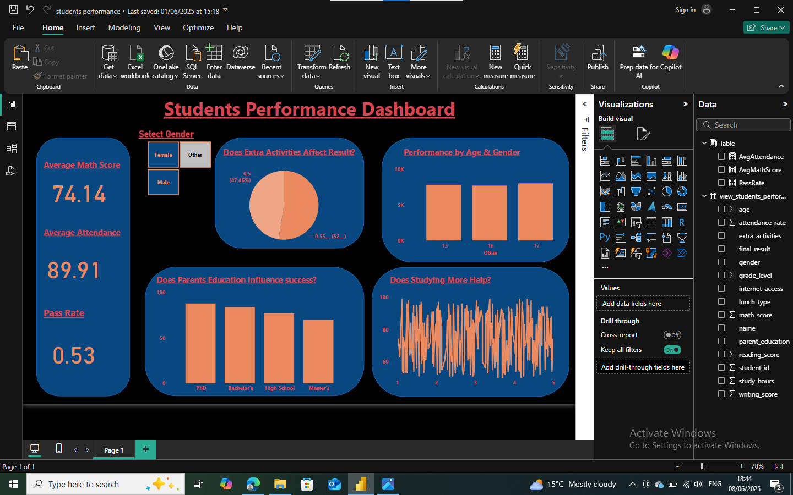
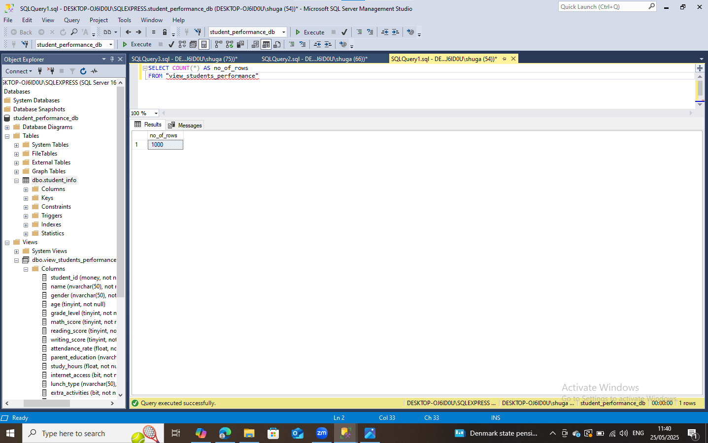
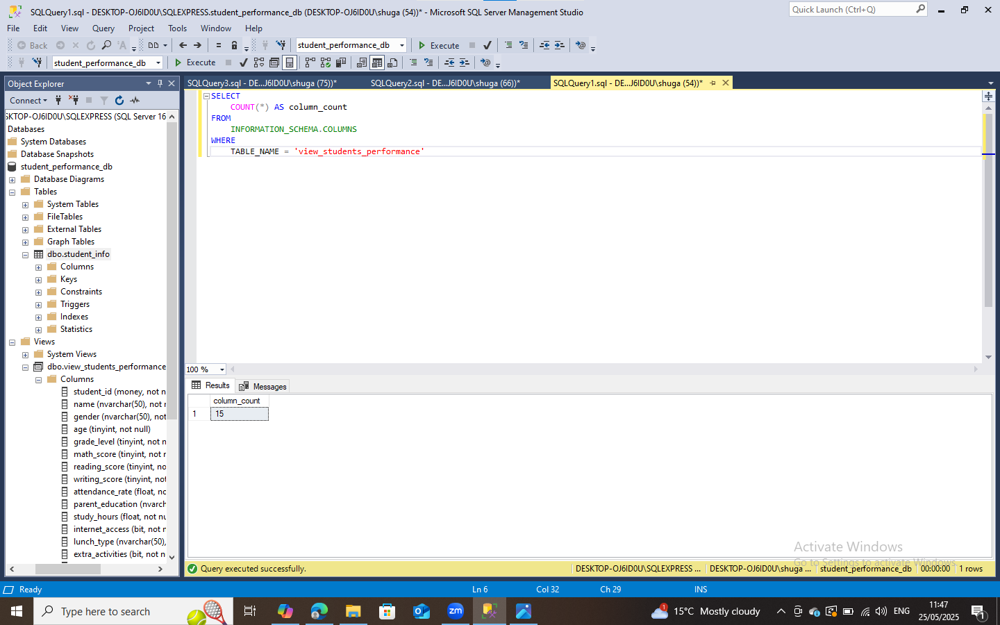
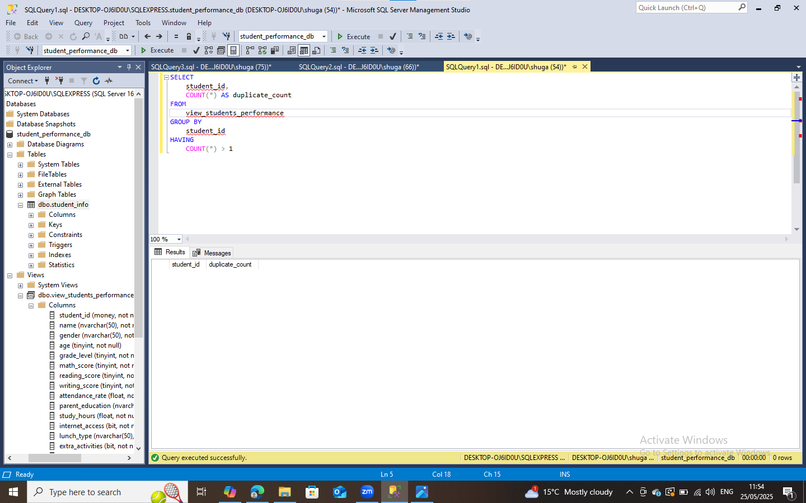
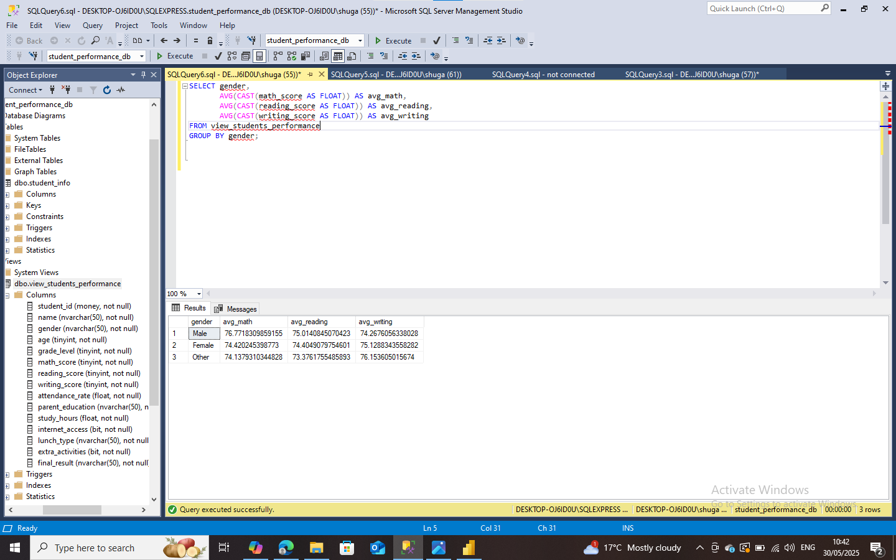
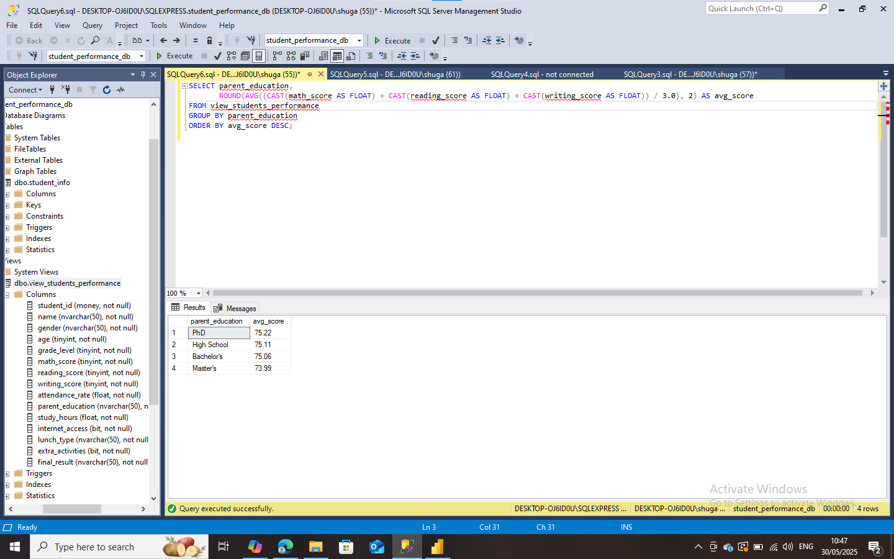
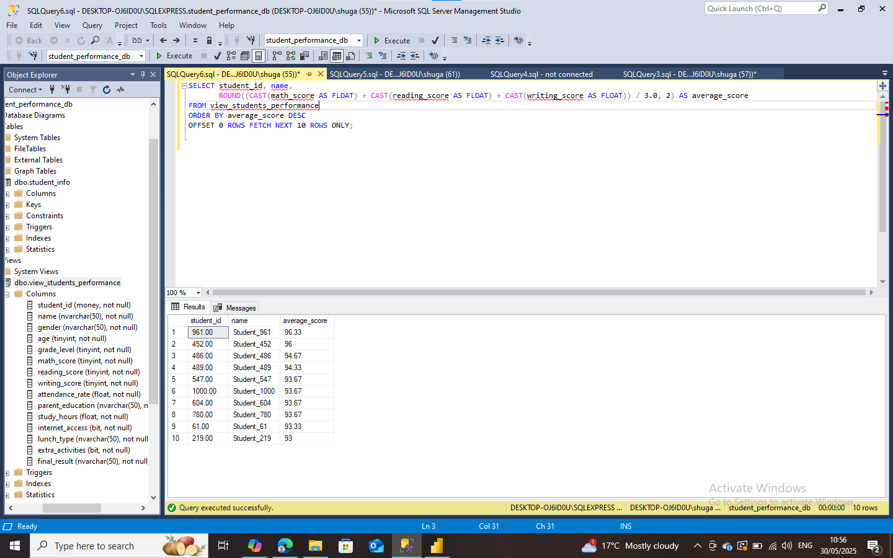
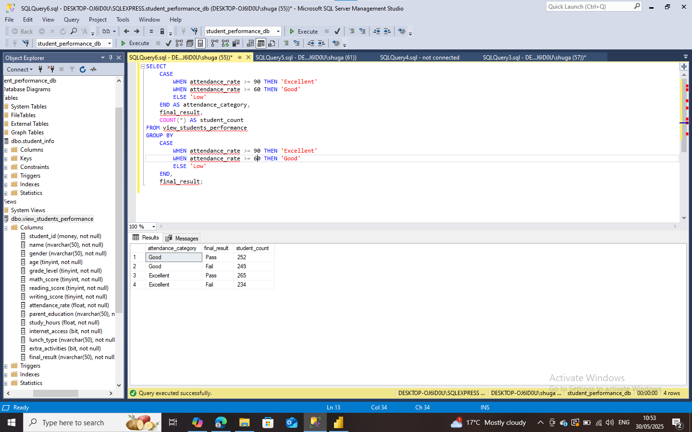

# 📊 Student Performance Data Analysis

This project explores how different factors affect student academic performance using **Power BI**, and **SQL**.  
It focuses on analyzing scores, demographics, and study habits to uncover meaningful patterns and insights.


---

## 📚 Table of Contents

1. [Tools Used](#tools-used)  
2. [Dataset Summary](#dataset-summary)  
3. [Power BI Features](#power-bi-features)  
4. [SQL Analysis](#sql-analysis)  
5. [Key Insights](#key-insights)  
6. [What I Learned](#what-i-learned)  
7. [Project Files](#project-structure)  
8. [Author Note](#author-note)  


---

## Tools Used

- **Power BI** – Interactive dashboards and slicers  
- **SQL** – Data cleaning, Data querying and aggregation for deeper insights  

---

## Dataset Summary

Includes:
- **Demographic Fields**: Gender, Parental Education, Lunch Type  
- **Academic Fields**: Math Score, Reading Score, Writing Score  
- **Other Fields**: Study Hours, Test Preparation Course  


---

## Power BI Features

The Power BI report offers an interactive view of student performance, using slicer, visuals, and key metrics.

### Left side Section – KPI Cards

At the left side of the dashboard, I created **Card visuals** aligned vertically to show key performance indicators (KPIs).  
These headline metrics provide a quick snapshot of student performance:

| DAX Measure         | Card Title              |
|---------------------|--------------------------|
| `AvgMathScore`      | Average Math Score       |
| `AvgAttendance`     | AvgAttendance     (%)    |
| `PassRate`          | Overall Pass Rate (%)    |

#### DAX Code Used

```DAX
-- Average Math Score
AvgMathScore = AVERAGE('view_students_performance'[math_score])

-- Attendance Rate (%)
AvgAttendanceRate = AVERAGE('view_students_performance'[attendance_rate])

-- Overall Pass Rate (%)
PassRate = 
DIVIDE(
    CALCULATE(COUNTROWS('view_students_performance'), 'view_students_performance'[final_result] = "Pass"),
    COUNTROWS('view_students_performance')
)

-- Student Performance Dashboard


---

## SQL Analysis

Sample queries included:
 -- Role count



  -- Column count



 -- Duplicate count
   


-- Average score by gender



-- Pass rate by parental education



-- Final Result Count by Grade Level


-- Top 10 Students by Average Score



-- Attendance Impact on Final Result




## Key Insights
 - Female students score higher in reading and writing
 - Higher parental education is linked to better student performance
 - Students who completed test prep score higher on average
 - More study hours and standard lunch positively affect outcomes

## ✅ What I Learned
 - How to clean and analyze data in Excel
 - How to design pivot dashboards and visuals
 - How to create interactive Power BI reports
 - How to write basic SQL queries to generate insights
 - How to connect insights across tools for one story

## 📂 Project Files
├── 📊 Data set
 (student_performance_data.csv`)(assets/docs/student_info.csv)

├── 📈 Power BI Live Report (pbix)
(PowerBI_report)(assets/docs/students performance.pbix)


## 📌 Author Note
 - This project was created as part of my Data Analysis learning journey.
 - It showcases how tools like Excel, Power BI, and SQL can work together to tell stories with data.
