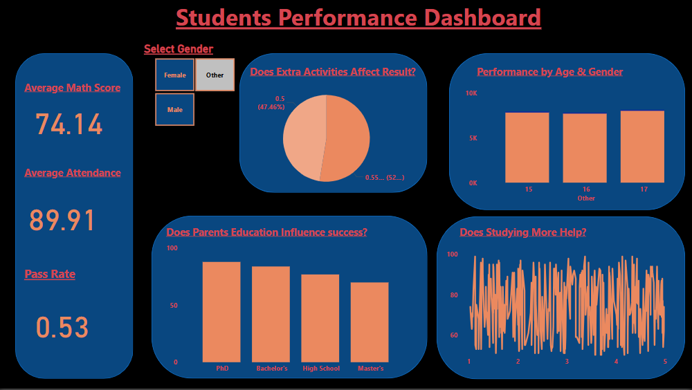

# 📊 Student Performance Data Analysis

This project explores how different factors affect student academic performance using **Power BI**, and **SQL**.  
It focuses on analyzing scores, demographics, and study habits to uncover meaningful patterns and insights.


---

## 📚 Table of Contents

1. [Tools Used](#-tools-used)  
2. [Dataset Summary](#-dataset-summary)  
3. [Power BI Features](#-power-bi-features)  
4. [SQL Analysis](#-sql-analysis)  
5. [Key Insights](#-key-insights)  
6. [What I Learned](#-what-i-learned)  
7. [Project Files](#-project-structure)  
8. [Author Note](#-author-note)  


---

## Tools Used

- **Power BI** – Interactive dashboards and slicers  
- **SQL** – Data cleaning, Data querying and aggregation for deeper insights  

---

## Dataset Summary

Includes:
- **Demographic Fields**: Gender, Parental Education, Lunch Type  
- **Academic Fields**: Math Score, Reading Score, Writing Score  
- **Other Fields**: Study Hours, Test Preparation Course  


---

## Power BI Features

The Power BI report offers an interactive view of student performance, using filters, visuals, and key metrics.

### 🔷 Left side Section – KPI Cards

At the left side of the dashboard, I created **Card visuals** aligned vertically to show key performance indicators (KPIs).  
These headline metrics provide a quick snapshot of student performance:

| DAX Measure         | Card Title              |
|---------------------|--------------------------|
| `AvgMathScore`      | Average Math Score       |
| `AvgAttendance`     | AvgAttendance     (%)    |
| `PassRate`          | Overall Pass Rate (%)    |

#### DAX Code Used

```DAX
-- Average Math Score
AvgMathScore = AVERAGE('view_students_performance'[math_score])

-- Attendance Rate (%)
AvgAttendanceRate = AVERAGE('view_students_performance'[attendance_rate])

-- Overall Pass Rate (%)
PassRate = 
DIVIDE(
    CALCULATE(COUNTROWS('view_students_performance'), 'view_students_performance'[final_result] = "Pass"),
    COUNTROWS('view_students_performance')
)

-- Student Performance Dashboard


---

## SQL Analysis

Sample queries included:

```sql

-- Data cleaning/validation

 -- Row Count
 SELECT 
    COUNT(*) AS no_of_rows 
 FROM 
    "view_students_performance";


  -- Column count
  SELECT 
    COUNT(*) AS column_count 
  FROM 
    INFORMATION_SCHEMA.COLUMNS 
  WHERE 
    TABLE_NAME = 'view_students_performance';


 -- Duplicate count
   SELECT 
     student_id,
     COUNT(*) AS duplicate_count 
   FROM 
    "view_students_performance" 
   GROUP BY 
     student_id 
   HAVING 
     COUNT(*) > 1;


-- Average score by gender
SELECT gender, ROUND(AVG((math_score + reading_score + writing_score)/3), 2) AS avg_score
FROM view_students_performance
GROUP BY gender;


-- Pass rate by parental education
SELECT parent_education,
       COUNT(CASE WHEN average_score >= 70 THEN 1 END) AS pass_count,
       COUNT(*) AS total,
       ROUND(COUNT(CASE WHEN average_score >= 70 THEN 1 END)*100.0/COUNT(*), 2) AS pass_rate
FROM view_students_performance
GROUP BY parent_education;


-- Final Result Count by Grade Level
SELECT grade_level,
       final_result,
       COUNT(*) AS student_count
FROM view_students_performance
GROUP BY grade_level, final_result
ORDER BY grade_level, final_result;


-- Top 10 Students by Average Score
SELECT student_id, name,
       ROUND((CAST(math_score AS FLOAT) + CAST(reading_score AS FLOAT) + CAST(writing_score AS FLOAT)) / 3.0, 2) AS average_score
FROM view_students_performance
ORDER BY average_score DESC
OFFSET 0 ROWS FETCH NEXT 10 ROWS ONLY;


-- Attendance Impact on Final Result
SELECT 
    CASE 
        WHEN attendance_rate >= 90 THEN 'Excellent'
        WHEN attendance_rate >= 75 THEN 'Good'
        ELSE 'Low'
    END AS attendance_category,
    final_result,
    COUNT(*) AS student_count
FROM view_students_performance
GROUP BY 
    CASE 
        WHEN attendance_rate >= 90 THEN 'Excellent'
        WHEN attendance_rate >= 75 THEN 'Good'
        ELSE 'Low'
    END,
    final_result;


## Key Insights
 - Female students score higher in reading and writing
 - Higher parental education is linked to better student performance
 - Students who completed test prep score higher on average
 - More study hours and standard lunch positively affect outcomes

## ✅ What I Learned
 - How to clean and analyze data in Excel
 - How to design pivot dashboards and visuals
 - How to create interactive Power BI reports
 - How to write basic SQL queries to generate insights
 - How to connect insights across tools for one story

## 📂 Project Files
├── 📊 Data set
 !(assets/docs/student_info.csv)

├── 📈 Power BI Report (pbix)
(assets/docs/students performance.pbix)


## 📌 Author Note
 - This project was created as part of my Data Analysis learning journey.
 - It showcases how tools like Excel, Power BI, and SQL can work together to tell stories with data.
